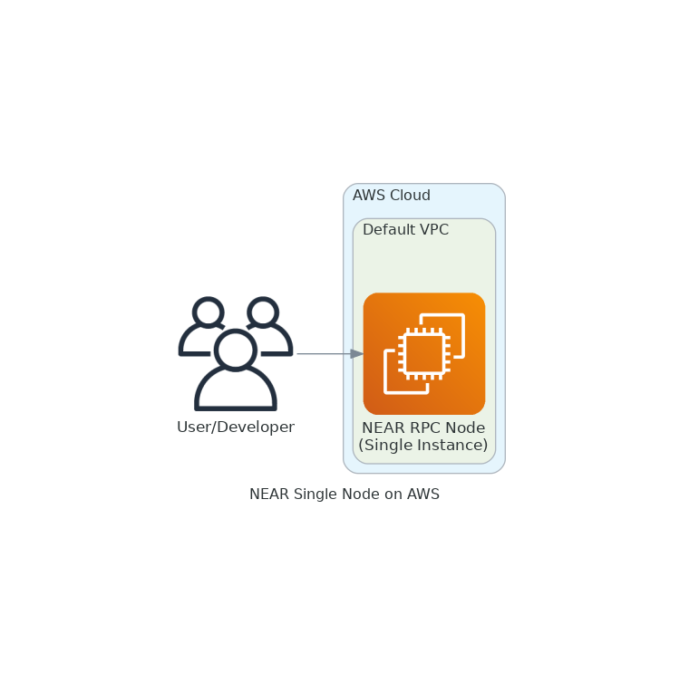
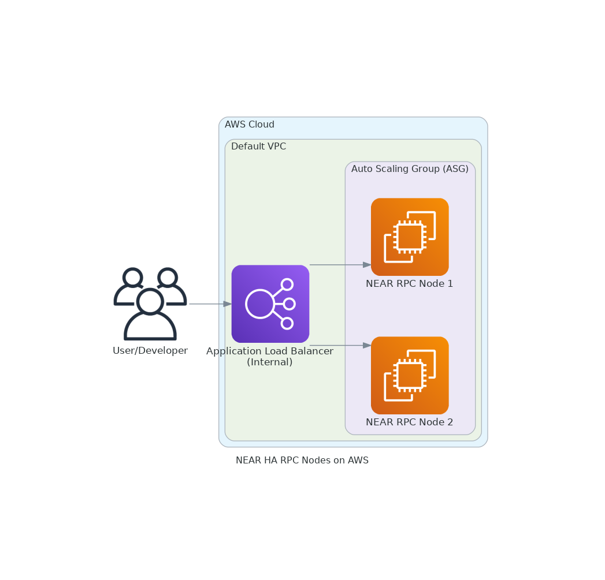

# NEAR Node Runner Blueprint (AWS CDK)

Provision NEAR RPC and single nodes on AWS using a reusable, production-grade CDK blueprint. This follows the conventions of the Ethereum, Solana, and other blueprints in this repository.

## Table of Contents
- [NEAR Node Runner Blueprint (AWS CDK)](#near-node-runner-blueprint-aws-cdk)
  - [Table of Contents](#table-of-contents)
  - [Overview](#overview)
  - [Prerequisites](#prerequisites)
  - [Setup Instructions](#setup-instructions)
  - [Mock Deployment (Template Review)](#mock-deployment-template-review)
  - [Deploying to AWS](#deploying-to-aws)
  - [Cleaning Up](#cleaning-up)
  - [Synth Without Credentials](#synth-without-credentials)
  - [Architecture Overview](#architecture-overview)
    - [Single-Node Deployment](#single-node-deployment)
    - [HA (RPC Farm) Deployment](#ha-rpc-farm-deployment)
  - [CloudWatch Monitoring](#cloudwatch-monitoring)
  - [Optimizing Data Transfer Costs](#optimizing-data-transfer-costs)
  - [Well-Architected Checklist](#well-architected-checklist)
  - [Useful Links](#useful-links)

---

## Overview

This blueprint provisions the AWS infrastructure required to run **NEAR RPC and/or single nodes** on Amazon EC2. It is designed for both development and production, supporting single-node and highly available (HA) deployments. The blueprint follows best practices for security, cost, and operational excellence, and is modeled after the Ethereum, Solana, and BSC blueprints in this repository.

## Prerequisites

- **Node.js ≥ 18** and **npm**
- **AWS CDK v2** (`npm install -g aws-cdk` or use `npx cdk`)
- **AWS credentials** exported in your shell *or* configured via `aws configure`:

```bash
export AWS_ACCESS_KEY_ID=AKIA...               # required
export AWS_SECRET_ACCESS_KEY=xxxxxxxxxxxxxxxx  # required
export AWS_SESSION_TOKEN=yyyyyyyyyyyyyyyyyyy   # only if using STS/temp creds
export AWS_REGION=us-east-1                    # region can also be placed in .env or AWS config
```

If you use named profiles:
```bash
export AWS_PROFILE=myprofile
```

> **Note:** CDK stacks perform lookups (e.g., default VPC) at *synth* time. You must have credentials configured **even to run `cdk synth`**.

## Setup Instructions

Follow these steps to prepare your environment:

1. **Clone the repository and install dependencies**

   ```bash
   git clone https://github.com/aws-samples/aws-blockchain-node-runners.git
   cd aws-blockchain-node-runners
   npm install
   ```

2. **Enter the NEAR blueprint directory**

   ```bash
   cd lib/near
   ```

3. **Configure your environment**

   Copy the sample environment file and edit it to customize values (network, instance size, etc.):

   ```bash
   cp .env-sample .env
   $EDITOR .env
   ```

4. **Build and prepare**

   ```bash
   npm run build
   npx cdk bootstrap
   npx cdk synth
   ```

After completing these setup steps, choose one of the deployment options below.

## Mock Deployment (Template Review)

If you only want to **review CloudFormation templates** without deploying resources, the `npx cdk synth` command from step 4 above generates templates in `cdk.out/` with **no resources deployed**.

## Deploying to AWS

After completing the setup steps above:

1. **Deploy common resources**
   ```bash
   npx cdk deploy near-common
   ```

2. **Deploy your node configuration**
   ```bash
   # Single node
   npx cdk deploy near-single-node
   
   # OR HA setup
   npx cdk deploy near-rpc-nodes
   ```

   **Note:** Your deployment choice depends on the `DEPLOY_MODE` setting in `.env`.

## Cleaning Up

```bash
npx cdk destroy near-rpc-nodes     # or near-single-node
npx cdk destroy near-common
```

> **Remember:** Remove EBS volumes or S3 snapshots if you created any outside of CDK.

## Synth Without Credentials

If you **cannot** or **do not want to** provide AWS credentials:

1. Pre-populate `cdk.context.json` with lookup results from an environment that *does* have credentials. CDK will then use cached context and not make live AWS calls.
2. Refactor the stacks to **avoid lookups** (pass VPC/Subnet IDs via env vars or config). The code is structured so you can replace `Vpc.fromLookup` with `Vpc.fromVpcAttributes` if needed.

## Architecture Overview

### Single-Node Deployment



*One EC2 instance in the default VPC. Security group rules open NEAR P2P (24567) + internal RPC (3030). Used for development or low-traffic private workloads.*

### HA (RPC Farm) Deployment



*Auto Scaling Group (up to 4 nodes) behind an internal Application Load Balancer. ALB listens on port 3030. Nodes share identical user-data and CloudWatch dashboards.*

## CloudWatch Monitoring

This blueprint includes comprehensive CloudWatch monitoring for your NEAR nodes:

### Metrics Collected

**System Metrics** (via CloudWatch Agent):
- CPU utilization and IO wait
- Memory usage
- Network traffic (in/out)
- Disk I/O metrics (reads/writes, throughput, latency)
- Disk usage percentage

**NEAR-Specific Metrics** (collected every minute):
- `near_block_height` - Current blockchain height
- `near_sync_status` - Node sync status (1=synced, 0=syncing)
- `near_peer_count` - Number of connected peers

### CloudWatch Dashboards

Both single-node and HA deployments automatically create CloudWatch dashboards with:
- Real-time visualization of all metrics
- Multi-instance view for HA deployments
- Automatic instance discovery

### Health Checks

- Health endpoint available on port 8080 (`/status` or `/health`)
- Used by Application Load Balancer for automatic instance replacement
- Returns JSON status of NEAR service

> **Note:** NEAR-specific metrics require the RPC endpoint to be available, which typically takes a few minutes after node startup.

## Optimizing Data Transfer Costs

NEAR RPC nodes can emit **tens of terabytes** of outbound traffic each month. Consider:

- Using the `LIMIT_OUT_TRAFFIC_MBPS` setting (see `.env`) to rate-limit egress once the node is in sync. 20 Mbit/s ≈ 6 TiB/month.
- Keeping the RPC endpoint **private** (inside the VPC) and fronting it with your own cache or API gateway.
- Exploring AWS **PrivateLink** or **Gateway Load Balancer** for multi-VPC access without Internet egress charges.

## Well-Architected Checklist

This is the Well-Architected checklist for NEAR nodes implementation of the AWS Blockchain Node Runner app. This checklist takes into account questions from the [AWS Well-Architected Framework](https://aws.amazon.com/architecture/well-architected/) which are relevant to this workload. Please feel free to add more checks from the framework if required for your workload.

| Pillar                  | Control                           | Question/Check                                                                   | Remarks |
|:------------------------|:----------------------------------|:---------------------------------------------------------------------------------|:--------|
| Security                | Network protection                | Are there unnecessary open ports in security groups?                             | Please note that port 24567 (TCP/UDP) for NEAR is open to public to support P2P protocols. We rely on the protection mechanisms built into the NEAR node software to protect those ports. |
|                         |                                   | Traffic inspection                                                               | Traffic protection is not used in the solution. AWS Web Applications Firewall (WAF) could be implemented for traffic inspection. Additional charges will apply. |
|                         | Compute protection                | Reduce attack surface                                                            | This solution uses Amazon Linux 2023 AMI. You may choose to run hardening scripts on it. |
|                         |                                   | Enable people to perform actions at a distance                                   | This solution uses AWS Systems Manager for terminal session, not ssh ports. |
|                         | Data protection at rest           | Use encrypted Amazon Elastic Block Store (Amazon EBS) volumes                    | This solution uses encrypted Amazon EBS volumes. |
|                         | Data protection in transit        | Use TLS                                                                          | The AWS Application Load balancer currently uses HTTP listener. Create HTTPS listener with self signed certificate if TLS is desired. |
|                         | Authorization and access control  | Use instance profile with Amazon Elastic Compute Cloud (Amazon EC2) instances    | This solution uses AWS Identity and Access Management (AWS IAM) role instead of IAM user. |
|                         |                                   | Following principle of least privilege access                                    | In all node types, root user is not used (using special user "ec2-user" instead). |
|                         | Application security              | Security focused development practices                                           | cdk-nag is being used with appropriate suppressions. |
| Cost optimization       | Service selection                 | Use cost effective resources                                                     | 1/ Graviton-based instances are used by default for best price/performance. 2/ Cost-effective EBS gp3 volumes are used. 3/ NEAR nodes can generate substantial outbound traffic - use LIMIT_OUT_TRAFFIC_MBPS to control costs. |
|                         | Cost awareness                    | Estimate costs                                                                   | Single RPC node with `m7g.2xlarge` and EBS gp3 volumes will cost approximately $500-800 per month in US East (N. Virginia) region with On-Demand pricing. Data transfer costs can add $500-2000+ per month for high-traffic RPC nodes. Use [AWS Pricing Calculator](https://calculator.aws/) for estimates. |
| Reliability             | Resiliency implementation         | Withstand component failures                                                     | This solution uses AWS Application Load Balancer with RPC nodes for high availability. Auto Scaling can replace failed instances automatically. |
|                         | Data backup                       | How is data backed up?                                                           | Blockchain data is replicated by nodes automatically. NEAR nodes can sync from network within hours, so no additional backup mechanisms are implemented. |
|                         | Resource monitoring               | How are workload resources monitored?                                            | Resources are monitored using Amazon CloudWatch dashboards with custom NEAR-specific metrics (block height, sync status, peer count). CloudWatch Agent collects system metrics every 60 seconds. Health checks on port 8080 enable automatic failure detection. |
| Performance efficiency  | Compute selection                 | How is compute solution selected?                                                | Compute solution is selected based on best price-performance, i.e. AWS Graviton-based Amazon EC2 instances. |
|                         | Storage selection                 | How is storage solution selected?                                                | Storage solution uses gp3 Amazon EBS volumes with optimal IOPS and throughput for best price-performance. |
|                         | Architecture selection            | How is the best performance architecture selected?                               | We used recommendations from the NEAR community and AWS best practices for blockchain workloads. |
| Operational excellence  | Workload health                   | How is health of workload determined?                                            | Health is determined via AWS Application Load Balancer Target Group Health Checks on port 3030. |
| Sustainability          | Hardware & services               | Select most efficient hardware for your workload                                 | The solution uses AWS Graviton-based Amazon EC2 instances which offer the best performance per watt of energy use in Amazon EC2. |

## Useful Links

- [AWS CDK docs – Environment-Agnostic Stacks](https://docs.aws.amazon.com/cdk/latest/guide/environments.html#environments_env_agnostic)
- [AWS CDK docs – Sharing & Reusing Context](https://docs.aws.amazon.com/cdk/latest/guide/context.html#context-sharing)
- [NEAR node documentation](https://github.com/near/node-docs)

---

© 2025 AWS Samples – Licensed under the Apache 2.0 License 