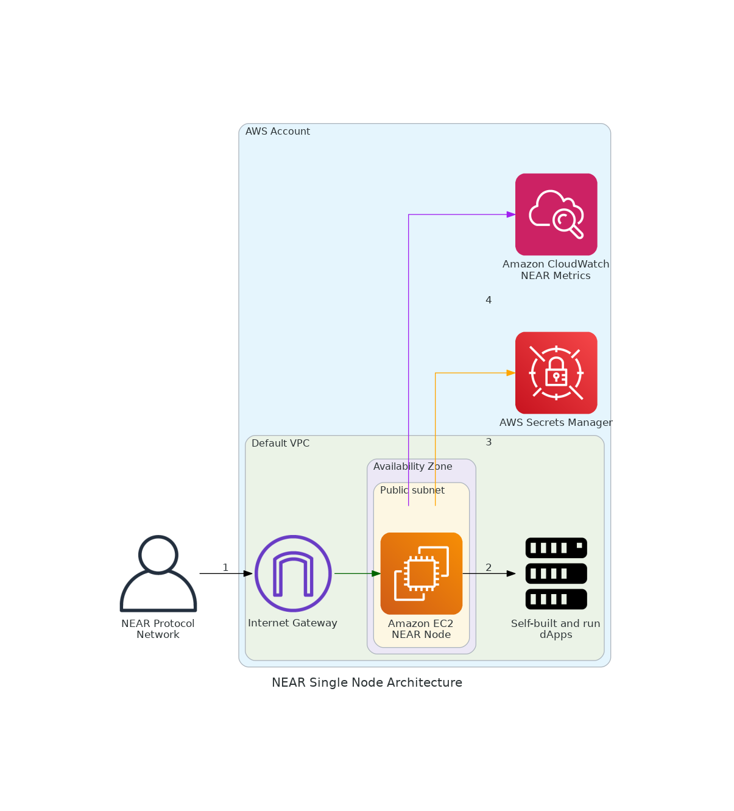
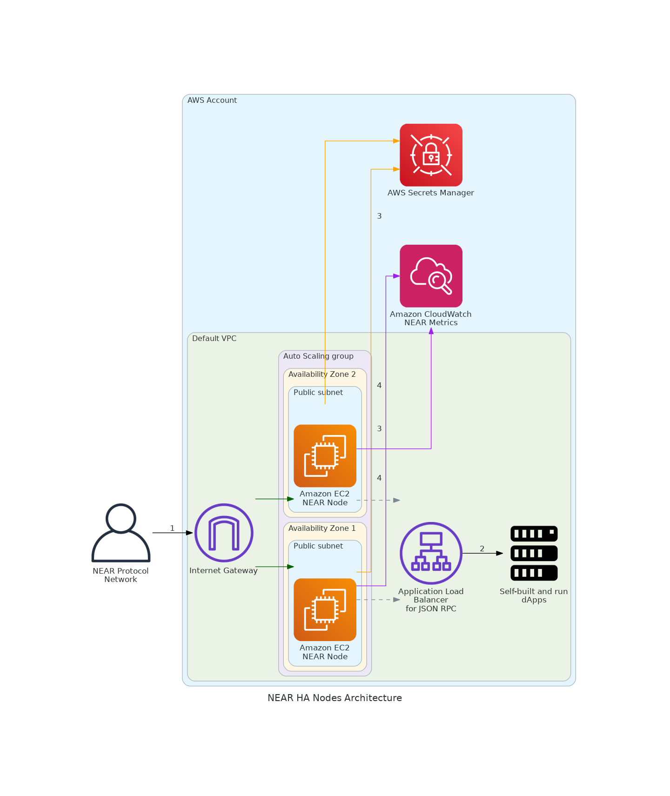

# NEAR Node Runner Blueprint (AWS CDK)

| Contributed by |
|:--------------------:|
| AWS Blockchain Node Runners Team |

Provision NEAR RPC and single nodes on AWS using a reusable, production-grade CDK blueprint. This follows the conventions of the Ethereum, Solana, and other blueprints in this repository.

## Overview

This blueprint provisions the AWS infrastructure required to run **NEAR RPC and/or single nodes** on Amazon EC2. It is designed for both development and production, supporting single-node and highly available (HA) deployments. The blueprint follows best practices for security, cost, and operational excellence, and is modeled after the Ethereum, Solana, and BSC blueprints in this repository.

## Table of Contents
- [Overview](#overview)
- [Prerequisites](#prerequisites)
- [Setup Instructions](#setup-instructions)
  - [Open AWS CloudShell](#open-aws-cloudshell)
  - [Clone Repository](#clone-repository)
  - [Configure Your Setup](#configure-your-setup)
  - [Deploy Common Components](#deploy-common-components)
- [Deploy a Single Node](#deploy-a-single-node)
- [Deploy HA Nodes](#deploy-ha-nodes)
- [Deployment Architecture](#deployment-architecture)
  - [Single Node Setup](#single-node-setup)
  - [HA RPC Farm Setup](#ha-rpc-farm-setup)
- [CloudWatch Monitoring](#cloudwatch-monitoring)
- [Cleaning Up](#cleaning-up)
- [Synth Without Credentials](#synth-without-credentials)
- [Additional Materials](#additional-materials)
  - [Managing Secrets](#managing-secrets)
  - [Optimizing Data Transfer Costs](#optimizing-data-transfer-costs)
  - [Well-Architected Checklist](#well-architected-checklist)
  - [Recommended Infrastructure](#recommended-infrastructure)
- [FAQ](#faq)
- [Upgrades](#upgrades)
- [Useful Links](#useful-links)

---

## Prerequisites

- **Node.js ≥ 18** and **npm**
- **AWS CDK v2** (`npm install -g aws-cdk` or use `npx cdk`)
- **AWS credentials** exported in your shell *or* configured via `aws configure`:

```bash
export AWS_ACCESS_KEY_ID=AKIA...               # required
export AWS_SECRET_ACCESS_KEY=xxxxxxxxxxxxxxxx  # required
export AWS_SESSION_TOKEN=yyyyyyyyyyyyyyyyyyy   # only if using STS/temp creds
export AWS_REGION=us-east-1                    # region can also be placed in .env or AWS config
```

If you use named profiles:
```bash
export AWS_PROFILE=myprofile
```

> **Note:** CDK stacks perform lookups (e.g., default VPC) at *synth* time. You must have credentials configured **even to run `cdk synth`**.

## Setup Instructions

### Open AWS CloudShell

To begin, ensure you login to your AWS account with permissions to create and modify resources in IAM, EC2, EBS, VPC, S3, KMS, and Secrets Manager.

From the AWS Management Console, open the [AWS CloudShell](https://docs.aws.amazon.com/cloudshell/latest/userguide/welcome.html), a web-based shell environment. If unfamiliar, review the [2-minute YouTube video](https://youtu.be/fz4rbjRaiQM) for an overview and check out [CloudShell with VPC environment](https://docs.aws.amazon.com/cloudshell/latest/userguide/creating-vpc-environment.html) that we'll use to test nodes API from internal IP address space.

### Clone Repository

```bash
git clone https://github.com/aws-samples/aws-blockchain-node-runners.git
cd aws-blockchain-node-runners
npm install
```

### Configure Your Setup

1. Make sure you are in the root directory of the cloned repository

2. If you have deleted or don't have the default VPC, create default VPC:

```bash
aws ec2 create-default-vpc
```

> **NOTE:** *You may see the following error if the default VPC already exists: `An error occurred (DefaultVpcAlreadyExists) when calling the CreateDefaultVpc operation: A Default VPC already exists for this account in this region.`. That means you can just continue with the following steps.*

3. Navigate to NEAR blueprint directory:

```bash
cd lib/near
```

4. Configure your environment by copying and editing the sample file:

```bash
cp .env-sample .env
nano .env
```

> **NOTE:** *You can find more examples inside `sample-configs` directory for different deployment scenarios.*

### Deploy Common Components

Deploy common components such as IAM roles:

```bash
npx cdk deploy near-common
```

## Deploy a Single Node

1. Deploy the node:

```bash
npx cdk deploy near-single-node --json --outputs-file single-node-deploy.json
```

2. After starting the node, wait for the initial synchronization process to finish. It may take 30 minutes to several hours depending on the network and snapshot availability. You can monitor progress using Amazon CloudWatch:

   - Navigate to [CloudWatch service](https://console.aws.amazon.com/cloudwatch/) (make sure you are in the region you have specified for `AWS_REGION`)
   - Open `Dashboards` and select `near-single-node` from the list of dashboards
   - Monitor `near_block_height` and `near_sync_status` metrics

3. Connect with the RPC API exposed by the node:

```bash
INSTANCE_ID=$(cat single-node-deploy.json | jq -r '..|.nodeinstanceid? | select(. != null)')
NODE_INTERNAL_IP=$(aws ec2 describe-instances --instance-ids $INSTANCE_ID --query 'Reservations[*].Instances[*].PrivateIpAddress' --output text)
echo "NODE_INTERNAL_IP=$NODE_INTERNAL_IP"
```

4. Test the RPC connection (from CloudShell VPC environment):

```bash
# IMPORTANT: Run from CloudShell VPC environment tab
curl -X POST http://$NODE_INTERNAL_IP:3030 \
  -H "Content-Type: application/json" \
  -d '{"jsonrpc": "2.0", "id": "1", "method": "status", "params": []}'
```

## Deploy HA Nodes

1. Deploy multiple HA RPC nodes:

```bash
npx cdk deploy near-rpc-nodes --json --outputs-file ha-nodes-deploy.json
```

2. Wait for nodes to sync (30 minutes to several hours), then query the load balancer:

```bash
export RPC_ALB_URL=$(cat ha-nodes-deploy.json | jq -r '..|.alburl? | select(. != null)')
echo "RPC_ALB_URL=$RPC_ALB_URL"
```

3. Test the RPC connection through the load balancer (from CloudShell VPC environment):

```bash
# IMPORTANT: Run from CloudShell VPC environment tab  
curl -X POST http://$RPC_ALB_URL:3030 \
  -H "Content-Type: application/json" \
  -d '{"jsonrpc": "2.0", "id": "1", "method": "status", "params": []}'
```

> **NOTE:** *By default and for security reasons, the load balancer is available only from within the default VPC in the region where it is deployed. It is not available from the Internet and is not open for external connections. Before opening it up please make sure you protect your RPC APIs.*

## Deployment Architecture

NEAR nodes on AWS can be deployed in 2 different configurations: single node setup for development/testing and highly available (HA) RPC farm for production workloads. Both configurations support standard RPC nodes or archival nodes with full blockchain history. You can choose to deploy on x86 or ARM-powered EC2 instances. See below for details on each deployment setup.

### Single Node Setup



1. A NEAR node deployed in the [Default VPC](https://docs.aws.amazon.com/vpc/latest/userguide/default-vpc.html) continuously synchronizes with the rest of nodes on [NEAR Protocol](https://near.org) through [Internet Gateway](https://docs.aws.amazon.com/vpc/latest/userguide/VPC_Internet_Gateway.html).
2. The NEAR node is used by dApps or development tools internally from within the Default VPC. JSON RPC API is not exposed to the Internet directly to protect nodes from unauthorized access.
3. The NEAR node can optionally use [AWS Secrets Manager](https://docs.aws.amazon.com/secretsmanager/latest/userguide/intro.html) for secure key storage (though not required for standard RPC operation).
4. The NEAR node sends various monitoring metrics for both EC2 and NEAR nodes to Amazon CloudWatch.

### HA RPC Farm Setup



1. A set of NEAR RPC nodes are deployed within the [Auto Scaling Group](https://docs.aws.amazon.com/autoscaling/ec2/userguide/auto-scaling-groups.html) in the [Default VPC](https://docs.aws.amazon.com/vpc/latest/userguide/default-vpc.html) continuously synchronizes with the rest of nodes on [NEAR Protocol](https://near.org) through [Internet Gateway](https://docs.aws.amazon.com/vpc/latest/userguide/VPC_Internet_Gateway.html).
2. The NEAR nodes are accessed by dApps or development tools internally through [Application Load Balancer](https://docs.aws.amazon.com/elasticloadbalancing/latest/application/introduction.html). JSON RPC API is not exposed to the Internet to protect nodes from unauthorized access. dApps need to handle user authentication and API protection, like [in this example for dApps on AWS](https://aws.amazon.com/blogs/architecture/dapp-authentication-with-amazon-cognito-and-web3-proxy-with-amazon-api-gateway/).
3. The NEAR nodes can optionally use [AWS Secrets Manager](https://docs.aws.amazon.com/secretsmanager/latest/userguide/intro.html) for secure key storage (though not required for standard RPC operation).
4. The NEAR nodes send various monitoring metrics for both EC2 and NEAR nodes to Amazon CloudWatch.

## CloudWatch Monitoring

This blueprint includes comprehensive CloudWatch monitoring for your NEAR nodes:

### Metrics Collected

**System Metrics** (via CloudWatch Agent):
- CPU utilization and IO wait
- Memory usage
- Network traffic (in/out)
- Disk I/O metrics (reads/writes, throughput, latency)
- Disk usage percentage

**NEAR-Specific Metrics** (collected every minute):
- `near_block_height` - Current blockchain height
- `near_sync_status` - Node sync status (1=synced, 0=syncing)
- `near_peer_count` - Number of connected peers

### CloudWatch Dashboards

Both single-node and HA deployments automatically create CloudWatch dashboards with:
- Real-time visualization of all metrics
- Multi-instance view for HA deployments
- Automatic instance discovery

### Health Checks

- Health endpoint available on port 8080 (`/status` or `/health`)
- Used by Application Load Balancer for automatic instance replacement
- Returns JSON status of NEAR service

> **Note:** NEAR-specific metrics require the RPC endpoint to be available, which typically takes a few minutes after node startup.

## Cleaning Up

Destroy HA Nodes, Single Nodes and Common stacks:

```bash
# Setting the AWS account id and region in case local .env file is lost
export AWS_ACCOUNT_ID=<your_target_AWS_account_id>
export AWS_REGION=<your_target_AWS_region>

# Make sure you are in aws-blockchain-node-runners/lib/near
pwd

# Destroy HA Nodes
npx cdk destroy near-rpc-nodes

# Destroy Single Node  
npx cdk destroy near-single-node

# Delete all common components like IAM role
npx cdk destroy near-common
```

> **Remember:** Remove any manually created EBS volumes or S3 snapshots if you created any outside of CDK.

## Synth Without Credentials

If you **cannot** or **do not want to** provide AWS credentials:

1. Pre-populate `cdk.context.json` with lookup results from an environment that *does* have credentials. CDK will then use cached context and not make live AWS calls.
2. Refactor the stacks to **avoid lookups** (pass VPC/Subnet IDs via env vars or config). The code is structured so you can replace `Vpc.fromLookup` with `Vpc.fromVpcAttributes` if needed.

## Additional Materials

<details>
<summary>Managing Secrets</summary>

NEAR nodes do not require AWS Secrets Manager for standard RPC node operation. Unlike some other blockchain nodes, NEAR RPC nodes:

- **Do not require API keys** for node operation
- **Generate their own node keys** automatically on first startup
- **Do not need authentication tokens** for RPC access
- **Store all configuration** in standard config files

The node identity is automatically generated and stored on the EBS volume. If you need to preserve node identity across redeployments, you can backup the node key files from the data directory.

> **Note:** The common stack includes SecretsManagerReadWrite policy for compatibility with other blockchain blueprints, but it is not actively used by NEAR nodes.
</details>

<details>
<summary>Optimizing Data Transfer Costs</summary>

NEAR RPC nodes can generate significant outbound traffic, potentially reaching **tens of terabytes** per month for heavily used RPC endpoints. To manage associated costs:

**Built-in Traffic Limiting:**
- Use the `NEAR_LIMIT_OUT_TRAFFIC_MBPS` setting in your `.env` file to rate-limit egress once the node is in sync
- Default setting: 20 Mbit/s (~6.5 TiB/month)
- The system automatically removes limits when the node falls behind and needs to catch up

**Additional Cost Optimization Strategies:**
- Keep RPC endpoints **private** (inside VPC) and use API gateways with caching
- Implement request rate limiting at the application level
- Use AWS **PrivateLink** for multi-VPC access without Internet egress charges
- Consider **AWS Direct Connect** for high-volume, predictable workloads

**Traffic Monitoring:**
- Monitor data transfer costs in AWS Cost Explorer
- Set up billing alerts for unexpected spikes
- Use VPC Flow Logs to analyze traffic patterns
</details>

<details>
<summary>Well-Architected Checklist</summary>

This is the Well-Architected checklist for NEAR nodes implementation of the AWS Blockchain Node Runner app. This checklist takes into account questions from the [AWS Well-Architected Framework](https://aws.amazon.com/architecture/well-architected/) which are relevant to this workload.

| Pillar                  | Control                           | Question/Check                                                                   | Remarks |
|:------------------------|:----------------------------------|:---------------------------------------------------------------------------------|:--------|
| Security                | Network protection                | Are there unnecessary open ports in security groups?                             | Please note that port 24567 (TCP/UDP) for NEAR is open to public to support P2P protocols. We rely on the protection mechanisms built into the NEAR node software to protect those ports. |
|                         |                                   | Traffic inspection                                                               | Traffic protection is not used in the solution. AWS Web Applications Firewall (WAF) could be implemented for traffic inspection. Additional charges will apply. |
|                         | Compute protection                | Reduce attack surface                                                            | This solution uses Amazon Linux 2023 AMI. You may choose to run hardening scripts on it. |
|                         |                                   | Enable people to perform actions at a distance                                   | This solution uses AWS Systems Manager for terminal session, not ssh ports. |
|                         | Data protection at rest           | Use encrypted Amazon Elastic Block Store (Amazon EBS) volumes                    | This solution uses encrypted Amazon EBS volumes. |
|                         | Data protection in transit        | Use TLS                                                                          | The AWS Application Load balancer currently uses HTTP listener. Create HTTPS listener with self signed certificate if TLS is desired. |
|                         | Authorization and access control  | Use instance profile with Amazon Elastic Compute Cloud (Amazon EC2) instances    | This solution uses AWS Identity and Access Management (AWS IAM) role instead of IAM user. |
|                         |                                   | Following principle of least privilege access                                    | In all node types, root user is not used (using special user "ec2-user" instead). |
|                         | Application security              | Security focused development practices                                           | cdk-nag is being used with appropriate suppressions. |
| Cost optimization       | Service selection                 | Use cost effective resources                                                     | 1/ Graviton-based instances are used by default for best price/performance. 2/ Cost-effective EBS gp3 volumes are used. 3/ NEAR nodes can generate substantial outbound traffic - use NEAR_LIMIT_OUT_TRAFFIC_MBPS to control costs. |
|                         | Cost awareness                    | Estimate costs                                                                   | Single RPC node with `m7g.2xlarge` and EBS gp3 volumes will cost approximately $500-800 per month in US East (N. Virginia) region with On-Demand pricing. Data transfer costs can add $500-2000+ per month for high-traffic RPC nodes. Use [AWS Pricing Calculator](https://calculator.aws/) for estimates. |
| Reliability             | Resiliency implementation         | Withstand component failures                                                     | This solution uses AWS Application Load Balancer with RPC nodes for high availability. Auto Scaling can replace failed instances automatically. |
|                         | Data backup                       | How is data backed up?                                                           | Blockchain data is replicated by nodes automatically. NEAR nodes can sync from network within hours, so no additional backup mechanisms are implemented. |
|                         | Resource monitoring               | How are workload resources monitored?                                            | Resources are monitored using Amazon CloudWatch dashboards with custom NEAR-specific metrics (block height, sync status, peer count). CloudWatch Agent collects system metrics every 60 seconds. Health checks on port 8080 enable automatic failure detection. |
| Performance efficiency  | Compute selection                 | How is compute solution selected?                                                | Compute solution is selected based on best price-performance, i.e. AWS Graviton-based Amazon EC2 instances. |
|                         | Storage selection                 | How is storage solution selected?                                                | Storage solution uses gp3 Amazon EBS volumes with optimal IOPS and throughput for best price-performance. |
|                         | Architecture selection            | How is the best performance architecture selected?                               | We used recommendations from the NEAR community and AWS best practices for blockchain workloads. |
| Operational excellence  | Workload health                   | How is health of workload determined?                                            | Health is determined via AWS Application Load Balancer Target Group Health Checks on port 3030. |
| Sustainability          | Hardware & services               | Select most efficient hardware for your workload                                 | The solution uses AWS Graviton-based Amazon EC2 instances which offer the best performance per watt of energy use in Amazon EC2. |
</details>

<details>
<summary>Recommended Infrastructure</summary>

| Usage pattern  | Ideal configuration  | Primary option on AWS  | Data Transfer Estimates | Config reference |
|---|---|---|---|---|
| 1/ RPC node (archival=false) | 16 vCPU, 64 GiB RAM, Data volume: 1TB, 3K IOPS, 125 MB/s throughput | m7g.2xlarge, Data volume: EBS gp3, 1TB, 3K IOPS, 125 MB/s throughput | 10-50TB/month | [.env-sample](./sample-configs/single-testnet.env) |
| 2/ Archival RPC node | 32 vCPU, 128 GiB RAM, Data volume: 4TB, 10K IOPS, 250 MB/s throughput | m7g.4xlarge, Data volume: EBS gp3, 4TB, 10K IOPS, 250 MB/s throughput | 20-100TB/month | [.env-sample-archival](./sample-configs/ha-rpc-mainnet.env) |
</details>

## FAQ

<details>
<summary>Frequently Asked Questions</summary>

### 1. How to check the logs of the NEAR node running on my instance?

> **NOTE:** *In this tutorial we chose not to use SSH and use Session Manager instead. That allows you to log all sessions in AWS CloudTrail to see who logged into the server and when. If you receive an error similar to `SessionManagerPlugin is not found`, [install Session Manager plugin for AWS CLI](https://docs.aws.amazon.com/systems-manager/latest/userguide/session-manager-working-with-install-plugin.html)*

```bash
# Make sure you are in aws-blockchain-node-runners/lib/near
pwd

export INSTANCE_ID=$(cat single-node-deploy.json | jq -r '..|.nodeinstanceid? | select(. != null)')
echo "INSTANCE_ID=" $INSTANCE_ID
aws ssm start-session --target $INSTANCE_ID --region $AWS_REGION
sudo journalctl -o cat -fu near
```

### 2. How to check the logs from the EC2 user-data script?

```bash
# Make sure you are in aws-blockchain-node-runners/lib/near
pwd

export INSTANCE_ID=$(cat single-node-deploy.json | jq -r '..|.nodeinstanceid? | select(. != null)')
echo "INSTANCE_ID=" $INSTANCE_ID
aws ssm start-session --target $INSTANCE_ID --region $AWS_REGION
sudo cat /var/log/cloud-init-output.log
```

### 3. How can I restart the NEAR service?

```bash
export INSTANCE_ID=$(cat single-node-deploy.json | jq -r '..|.nodeinstanceid? | select(. != null)')
echo "INSTANCE_ID=" $INSTANCE_ID
aws ssm start-session --target $INSTANCE_ID --region $AWS_REGION
sudo systemctl restart near
sudo systemctl status near
```

### 4. How to check the sync status of my node?

```bash
# From CloudShell VPC environment
curl -X POST http://$NODE_INTERNAL_IP:3030 \
  -H "Content-Type: application/json" \
  -d '{"jsonrpc": "2.0", "id": "1", "method": "status", "params": []}' | jq .result.sync_info
```

### 5. How can I check if my node is fully synced?

Look for the `syncing` field in the status response. When it shows `false`, your node is fully synced:

```bash
curl -X POST http://$NODE_INTERNAL_IP:3030 \
  -H "Content-Type: application/json" \
  -d '{"jsonrpc": "2.0", "id": "1", "method": "status", "params": []}' | jq .result.sync_info.syncing
```

### 6. How to check network throttling configuration?

```bash
# Set network interface ID
INTERFACE=$(ip -br addr show | grep -v '^lo' | awk '{print $1}' | head -n1)

# Check traffic control (tc) configuration
tc qdisc show

# Watch current traffic
tc -s qdisc ls dev $INTERFACE

# Monitor bandwidth in real-time
iftop -i $INTERFACE
```

### 7. What ports need to be open for NEAR nodes?

- **24567** (TCP) - P2P communication with other NEAR nodes
- **3030** (TCP) - JSON-RPC endpoint (keep internal for security)
- **8080** (TCP) - Health check endpoint for load balancers
- **9333** (TCP) - Prometheus metrics endpoint (optional)

### 8. How much disk space do I need?

- **Non-archival node**: Start with 1TB, monitor usage as blockchain grows
- **Archival node**: Start with 4TB minimum, plan for growth
- **Growth rate**: Approximately 30-50GB per month (varies by network activity)

### 9. Can I change node configuration after deployment?

Yes, you can modify the configuration:
1. Update your `.env` file with new settings
2. Run `npx cdk deploy` to update the infrastructure
3. For some changes (like switching between archival/non-archival), you may need to clear the data directory

### 10. How long does initial sync take?

- **With snapshot**: 30 minutes to 2 hours
- **Without snapshot**: 6-24 hours depending on network and instance type
- **Archival node**: Can take several days without snapshot

### 11. How do I access CloudWatch dashboards for monitoring?

The blueprint automatically creates CloudWatch dashboards for your nodes:

1. Navigate to [CloudWatch Console](https://console.aws.amazon.com/cloudwatch/)
2. Select "Dashboards" from the left menu
3. Look for:
   - `near-single-node` - for single node deployments
   - `near-rpc-nodes` - for HA deployments
4. Dashboards show:
   - System metrics (CPU, memory, disk, network)
   - NEAR-specific metrics (block height, sync status, peer count)
   - Per-instance breakdowns for HA deployments
</details>

## Upgrades

When nodes need to be upgraded or downgraded, use a blue/green deployment pattern:

1. Deploy new nodes with updated configuration alongside existing ones
2. Wait for new nodes to sync  
3. Switch traffic to new nodes (update load balancer targets)
4. Decommission old nodes

This approach ensures zero downtime during upgrades. Automation for this process is not yet implemented and contributions are welcome!

## Useful Links

- [NEAR Protocol Documentation](https://docs.near.org/)
- [NEAR Node Documentation](https://near-nodes.io/)
- [NEAR RPC Endpoints Reference](https://docs.near.org/api/rpc/introduction)
- [AWS CDK Documentation](https://docs.aws.amazon.com/cdk/latest/guide/home.html)
- [AWS Well-Architected Framework](https://aws.amazon.com/architecture/well-architected/)

---

© 2025 AWS Samples – Licensed under the Apache 2.0 License 